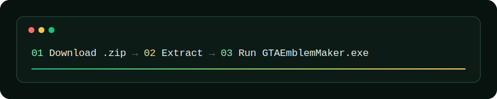
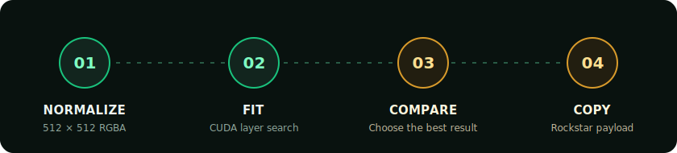

<picture>
  <source media="(prefers-color-scheme: dark)" srcset="./assets/banner-dark.svg">
  <source media="(prefers-color-scheme: light)" srcset="./assets/banner-light.svg">
  
</picture>

<p align="center">
  <a href="https://github.com/Debang0000/GTA-Emblem-Maker/releases/latest"></a>
  
  
  
</p>

<p align="center"><strong>Turn a raster image into a layered GTA crew emblem—locally, natively, and within Rockstar's payload budget.</strong></p>

<p align="center">
  <a href="#why-gta-emblem-maker">Features</a> &bull;
  <a href="#quick-start">Quick start</a> &bull;
  <a href="#choose-a-pipeline">Pipelines</a> &bull;
  <a href="#build-from-source">Build</a>
</p>

> [!IMPORTANT]
> GTA Emblem Maker is an unofficial community tool and is not affiliated with or endorsed by Rockstar Games or Take-Two Interactive.

<picture>
  <source media="(prefers-color-scheme: dark)" srcset="./assets/divider-dark.svg">
  <source media="(prefers-color-scheme: light)" srcset="./assets/divider-light.svg">
  
</picture>

## Why GTA Emblem Maker

<picture>
  <source media="(prefers-color-scheme: dark)" srcset="./assets/features-dark.svg">
  <source media="(prefers-color-scheme: light)" srcset="./assets/features-light.svg">
  
</picture>

The app converts a 512 × 512 RGBA target into Rockstar-supported primitive layers. A persistent CUDA scorer searches candidate geometry on the GPU, while the native WPF interface streams progress, previews completed results, and copies the final import payload.

Transparent source images receive alpha-aware error weighting and a transparent SVG background. Pipeline behavior lives in versioned JSON files under [`profiles`](./profiles), so quality strategies can evolve without hardcoding them into the UI.

## Quick start

<picture>
  <source media="(prefers-color-scheme: dark)" srcset="./assets/install-dark.svg">
  <source media="(prefers-color-scheme: light)" srcset="./assets/install-light.svg">
  
</picture>

1. Download [`GTAEmblemMaker-v1.1.1.zip`](https://github.com/Debang0000/GTA-Emblem-Maker/releases/download/v1.1.1/GTAEmblemMaker-v1.1.1.zip).
2. Extract the archive and run `GTAEmblemMaker.exe`.
3. Select an image and a fitting pipeline, then choose **Generate** or **Generate all**.
4. Compare the completed results and choose **Copy Code** for the Rockstar import payload.

**Runtime requirements:** Windows 10 version 1809 or newer, x64, .NET Framework 4.8, and a CUDA-capable NVIDIA GPU.

<picture>
  <source media="(prefers-color-scheme: dark)" srcset="./assets/steps-dark.svg">
  <source media="(prefers-color-scheme: light)" srcset="./assets/steps-light.svg">
  
</picture>

## Choose a pipeline

| Pipeline | Best for | Method |
| --- | --- | --- |
| **Beam Clean** | Faster clean results | Beam search without the pair-refinement pass |
| **Perceptual** | A different visual tradeoff | Greedy search with LPIPS v0.1 AlexNet 224 reranking through ONNX Runtime DirectML |
| **Official Catalog Quality** | Mixed Rockstar primitives | CUDA search over rotated primitives, nine official curves, and two official round shapes, with native edge-detail reranking |

**Generate all** runs all three pipelines so completed results can be compared in one session.

<details>
<summary><strong>How the fitting engine works</strong></summary>

1. Normalize the source into a 512 × 512 RGBA target and select opaque or alpha-aware weighting.
2. Generate and score rotated primitives on a persistent CUDA service without repeatedly transferring the working image between CPU and GPU.
3. Keep the strongest partial solutions with beam search while enforcing the configured payload budget.
4. Export Rockstar-compatible SVG and layer data, plus previews and run artifacts under `%LOCALAPPDATA%\GTAEmblemMaker\runs`.

</details>

## Build from source

Source builds require Windows x64, .NET Framework 4.8 developer tools, the MSVC toolchain, and the NVIDIA CUDA Toolkit.

```powershell
.\third_party\cuda-scorer\build.ps1
dotnet build .\native\GTAEmblemMaker.sln -c Release -p:Platform=x64
.\native\GTAEmblemMaker.Checks\bin\x64\Release\net48\GTAEmblemMaker.Checks.exe
```

Create the portable release archive with:

```powershell
.\scripts\package-windows.ps1
```

The archive is written under `release\`. The production package contains the native executable, CUDA scorer, profiles, perceptual model, and required runtime libraries—no browser or web runtime.

<picture>
  <source media="(prefers-color-scheme: dark)" srcset="./assets/divider-dark.svg">
  <source media="(prefers-color-scheme: light)" srcset="./assets/divider-light.svg">
  
</picture>

<p align="center"><sub>Built for emblem makers who would rather spend GPU time than place 1,500 shapes by hand.</sub></p>
