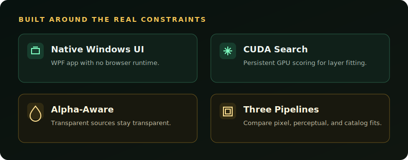

<picture>
  <source media="(prefers-color-scheme: dark)" srcset="./assets/banner-dark.svg">
  <source media="(prefers-color-scheme: light)" srcset="./assets/banner-light.svg">
  
</picture>

<p align="center">
  <a href="https://github.com/Debang0000/GTA-Emblem-Maker/releases/latest"></a>
  
  
  
</p>

<p align="center"><strong>A quality-first GTA emblem converter for complex images.</strong></p>

GTA Emblem Maker converts photos, illustrations, anime artwork, and clean logos into layered Rockstar emblems. It deliberately spends more compute time on reconstruction quality instead of trying to produce an instant outline-based result.

<p align="center">
  <a href="#why-another-emblem-converter">Why</a> &bull;
  <a href="#how-it-handles-complex-images">How it works</a> &bull;
  <a href="#quick-start">Download</a> &bull;
  <a href="#fitting-strategies">Strategies</a> &bull;
  <a href="#build-from-source">Build</a>
</p>

> [!IMPORTANT]
> GTA Emblem Maker is an unofficial community project and is not affiliated with or endorsed by Rockstar Games or Take-Two Interactive.

## Why another emblem converter?

Emblem Helper is the tool most creators already know: it runs online, finishes extremely quickly, requires no installation, and works well for structurally simple, logo-like images. GTA Emblem Maker remains the slower local option, with a dedicated Clean Logo pipeline when edge and color fidelity matter.

This project covers the opposite use case. It is for people who want to turn a complex picture into an emblem and are willing to download a Windows application, use an NVIDIA GPU, and wait longer for a more involved layered fit.

| | Emblem Helper | GTA Emblem Maker |
| --- | --- | --- |
| Best suited to | Fast conversion of simple logos | Photos, illustrations, anime art, and clean logos that need stricter edge control |
| Delivery | Online | Local Windows application |
| Speed | Extremely fast | Quality-first and compute-intensive |
| Hardware | No local GPU requirement | NVIDIA CUDA-capable GPU |
| Goal | Fast conversion of simple structure | Constrained reconstruction of complex structure and detail |

<picture>
  <source media="(prefers-color-scheme: dark)" srcset="./assets/features-dark.svg">
  <source media="(prefers-color-scheme: light)" srcset="./assets/features-light.svg">
  
</picture>

## How it handles complex images

### Constrained layered reconstruction

The source is treated as a 512 x 512 target that must be rebuilt from Rockstar-supported layered primitives while the generated import code stays within a fixed size budget. Each candidate can change position, size, rotation, color, opacity, and shape family. The result is not a traced bitmap or an uploaded image: it is a real stack of editable emblem layers.

### Search that does not commit too early

Beam search keeps multiple partial reconstructions alive instead of trusting every early greedy choice. The other strategies can rerank strong pixel-loss candidates with LPIPS AlexNet 224 or native edge-detail signals, helping preserve structure that a single error metric can miss.

### Mixed primitives and verified catalog geometry

The catalog strategy combines rotated ellipses, rectangles, triangles, line-like shapes, nine official Rockstar curves, and two official round shapes. Export uses the geometry, cleanup precision, transforms, and expanded SVG paths observed from Rockstar's own editor rather than assuming the compact catalog declarations are valid save data.

### Payload cost is part of the optimization

The fitter tracks generated-code cost while adding layers. A visually useful candidate still has to fit inside the decimal 1,250,000-character production budget and produce SVG plus layer data that Social Club accepts.

## Engineering the search

The algorithm is expensive by design, so the implementation has to keep that cost practical:

- A persistent CUDA scorer evaluates large candidate batches and stays alive across layers, avoiding repeated process startup and unnecessary CPU/GPU transfers.
- Production profiles use resident selection paths so candidate scoring can remain close to the working image on the GPU.
- ONNX Runtime DirectML hosts the LPIPS v0.1 AlexNet 224 reranker; the catalog strategy can instead use a native edge-detail signal.
- The native WPF application streams progress, supports cancellation, compares completed results, and records the canonical target, fitted shapes, trace, weight map, previews, profile snapshot, and final import payload for every run.
- The Rockstar exporter was validated against the live editor. Official-shape dimensions, layer rounding, transforms, and serialized paths were corrected from actual save behavior rather than inferred from visual appearance alone.

CUDA is an implementation requirement, not the reason to use the project. The reason is the more involved search it makes possible for difficult images.

## Quick start

1. Download [`GTAEmblemMaker-v1.1.3.exe`](https://github.com/Debang0000/GTA-Emblem-Maker/releases/download/v1.1.3/GTAEmblemMaker-v1.1.3.exe). The [portable ZIP](https://github.com/Debang0000/GTA-Emblem-Maker/releases/download/v1.1.3/GTAEmblemMaker-v1.1.3.zip) is also available.
2. Run the EXE, or extract the ZIP and run `GTAEmblemMaker.exe`.
3. Open an image, choose one fitting strategy or **Generate all**, and wait for the fit to complete.
4. Compare completed results, choose **Copy Import Code**, and run that code in the Rockstar emblem editor.

The self-extracting EXE stores its validated runtime under `%LOCALAPPDATA%\GTAEmblemMaker\app`. It does not require administrator rights. The application is currently unsigned, so Windows SmartScreen or antivirus software may warn about it; use the ZIP if preferred.

## Fitting strategies

| Strategy | Search behavior | Intended tradeoff |
| --- | --- | --- |
| **Beam Clean** | Keeps two partial fits and expands two branches per layer | Stable pixel-error fitting without an extra reranking backend |
| **Perceptual AlexNet 224** | Greedy fitting with late LPIPS reranking through DirectML | A different choice when perceptual structure matters more than the lowest raw pixel loss |
| **Official Catalog Quality** | Mixed primitives plus verified official curves and rounds, with native edge-detail reranking | Broader shape vocabulary and save-compatible catalog output |
| **Clean Logo** | Uses opaque source-derived colors, protected support, local-regression checks, and a final edge audit | Simple transparent graphics that must avoid stray colors, black fringes, and unsupported lines |

**Generate all** runs all four strategies so their completed outputs can be compared in the application. None is labeled universally best because the useful tradeoff depends on the source image.

## Requirements and tradeoffs

- Windows 10 version 1809 or newer, x64, and .NET Framework 4.8.
- An NVIDIA CUDA-capable GPU.
- Difficult images can take a long time to fit. This is the central quality-for-time tradeoff, not a fast online conversion workflow.
- Every output remains an approximation constrained by Rockstar-supported primitives and payload size.
- Images with or without transparency are supported; transparent-background handling is treated as normal input correctness, not a special mode.
- Run artifacts are written under `%LOCALAPPDATA%\GTAEmblemMaker\runs` for inspection and reproducibility.

## Examples

Real comparisons are coming later, including cat photos, anime illustrations, and optimization/conversion comparisons. No placeholder output is shown here because the examples should come from reproducible runs of the released build.

## Build from source

Source builds require Windows x64, .NET Framework 4.8 developer tools, the MSVC toolchain, and the NVIDIA CUDA Toolkit.

```powershell
.\third_party\cuda-scorer\build.ps1
dotnet build .\native\GTAEmblemMaker.sln -c Release -p:Platform=x64
.\native\GTAEmblemMaker.Checks\bin\x64\Release\net48\GTAEmblemMaker.Checks.exe
```

Create both release formats with:

```powershell
.\scripts\package-windows.ps1
```

The script produces a self-extracting EXE and a portable ZIP under `release\`. Both contain the same native application, CUDA scorer, profiles, perceptual model, licenses, and required runtime libraries. No browser or web runtime is bundled.
